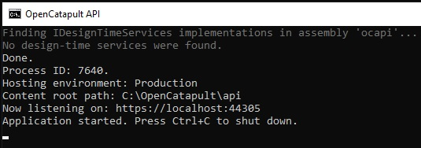
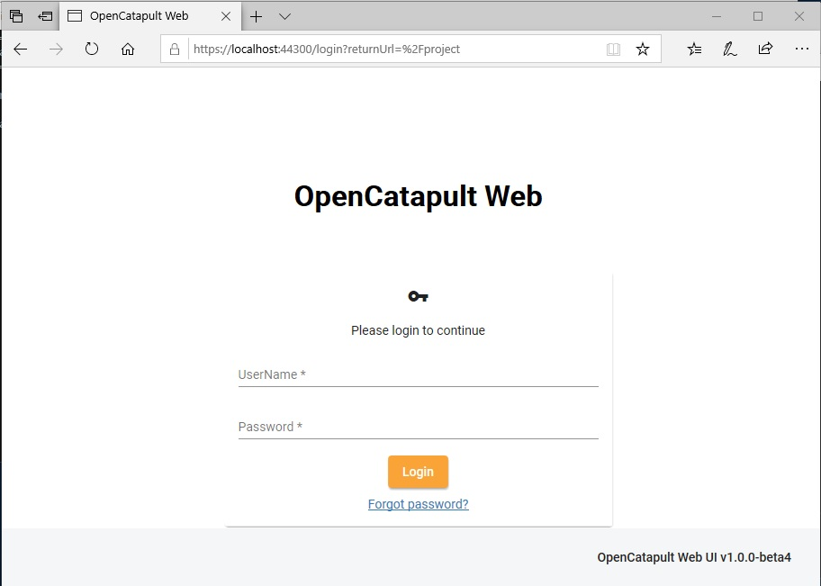

# Quick Start

This document will guide you to get started with `OpenCatapult`.

The easiest way to get started and use `OpenCatapult` is by utilizing the released package. At the moment it is only available for Windows x64 platform. We have been planning to release the package for other platforms (Linux or Mac) as well in the future.

If you want to try `OpenCatapult` in the platforms other than Windows now, you could always build it yourself from the source code which you can get from our [GitHub](https://github.com/Polyrific-Inc/OpenCatapult) repository. This [guide](../dev-guides/build-code.md) might be useful if you want to do it.

## Prerequisites

`OpenCatapult` requires **.NET Core 2.2 runtime** installed on your machine. If you don't have it, please get the installer from the [.NET download page](https://dotnet.microsoft.com/download). Please note that you just need the runtime, not the full SDK.

After installing the .NET Core runtime, please make sure it is correctly installed on your machine by typing this command in a Command Prompt:

```
dotnet --info
```

If you get something like the screenshot below, it means you are good to go.


## Get the released package

Please go to [OpenCatapult release website](https://releases.opencatapult.net) and download the latest package available in the `All Components` box. As of this writing, the latest package is `opencatapult-v1.0.0-beta4-win-x64.zip`.

## Run the components

Please follow these steps to run the `OpenCatapult` components:
1. Extract the released package into a location on your machine, e.g. `C:\OpenCatapult`
2. Open a Command Prompt with elevated permission (press Windows key > type "cmd" > select "Run as administrator")


3. In the Command Prompt, go to the extracted location, e.g. type "cd C:\OpenCatapult"


4. In the extracted location, type "run". It will open four new Command Prompt windows for each of the `OpenCatapult` component: API, Engine, CLI, and Web UI. Wait a minute for the process to complete, and find the windows for API and Web components and make sure they show as per screenshot below:




5. Open your browser, and go to `https://localhost:44300` to open the `OpenCatapult` Web UI



6. In the login page, enter "`admin@opencatapult.net`" as the UserName, and "`opencatapult`" as the Password. If you are able to login, it means the components have been setup correctly.


## Next steps

As you have the `OpenCatapult` setup on your machine, you can start to explore more about it.

- [create your first project](../user-guides/create-first-project-web.md)
- [try CLI (Command Line Interface)](../user-guides/data-models.md)
- [build from source code](../dev-guides/build-code.md)